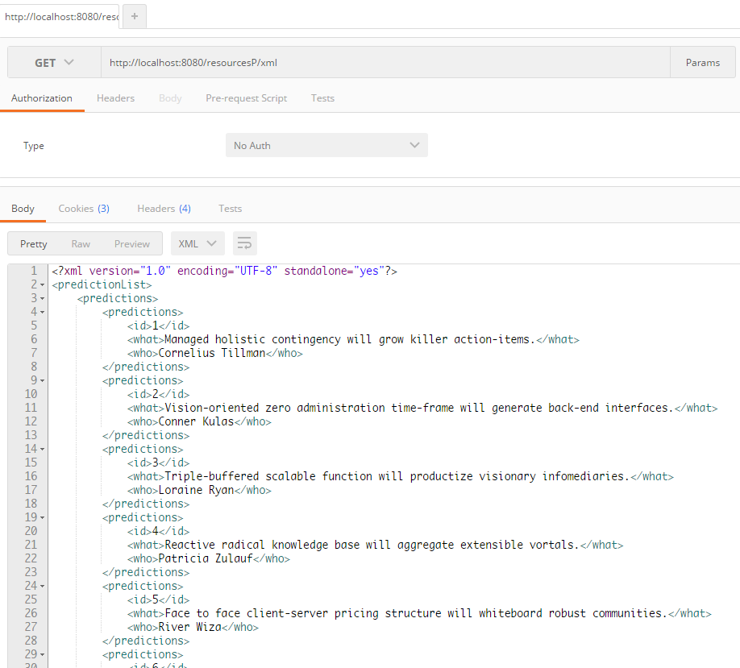

##JAX-RS与Jersey写的Restful webservice demo

见[《webservice笔记4—— JAX-RS实现rest风格的webservice》](http://www.dabu.info/webservice-use-jax-rs-restful.html)

截图：

获取整个list，以xml：
http://localhost:8080/resourcesP/xml

获取整个list，以json：
http://localhost:8080/resourcesP/json

获取单条记录：
http://localhost:8080/resourcesP/xml/1

http://localhost:8080/resourcesP/json/1

至于put，post，delete请求，见博客

